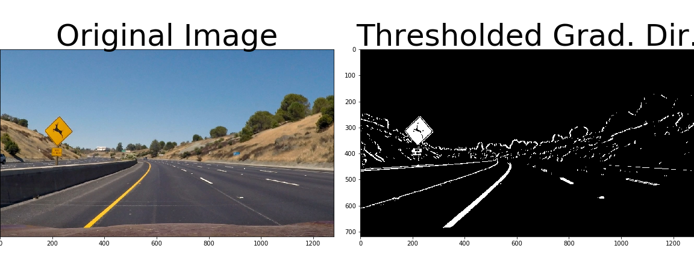
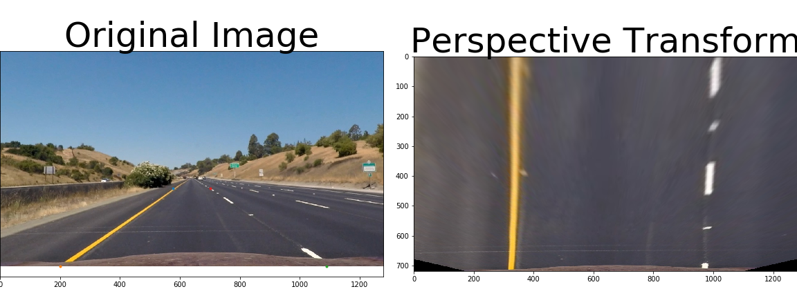
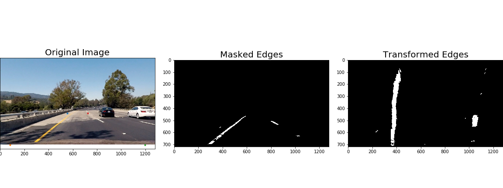
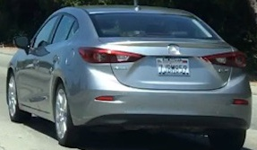
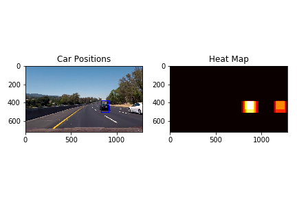
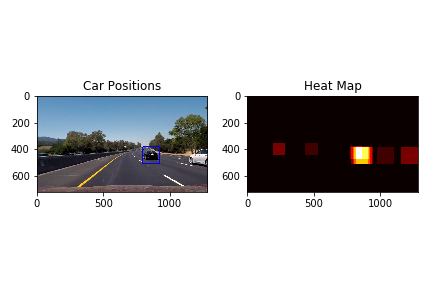
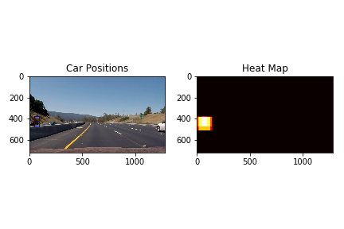
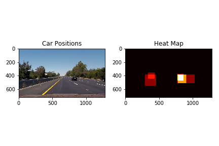

## Lane and Vehicle Detection
This repo contains the code for two projects in the Udacity Self-Driving Car NanoDegree: Lane Detection and Vehicle Detection.
[](https://www.youtube.com/watch?v=KISHFmMYJnc)

### Lane Detection
The steps for lane detection are the following:

* Compute the camera calibration matrix and distortion coefficients given a set of chessboard images.
* Apply a distortion correction to raw images.
* Use color transforms, gradients, etc., to create a thresholded binary image.
* Apply a perspective transform to rectify binary image ("birds-eye view").
* Detect lane pixels and fit to find the lane boundary.
* Determine the curvature of the lane and vehicle position with respect to center.
* Warp the detected lane boundaries back onto the original image.
* Output visual display of the lane boundaries and numerical estimation of lane curvature and vehicle position.


[](https://www.youtube.com/watch?v=kGVAMj7J2LI)

## Methods used to create create a thresholded binary image containing likely lane pixels.
The parameters used were in each method were tuned first seperately and then fine tuned using the combination of methods.


```python
# This method takes an image and the desired gradent orientation
# and comutes a sobel edge detected image in that gradient direction.
def abs_sobel_thresh(img, orient='x', sobel_kernel=3, thresh=(0, 255)):

    # Convert to grayscale
    gray = cv2.cvtColor(img, cv2.COLOR_BGR2GRAY)# cv2
    
    # Apply x or y gradient with the OpenCV Sobel() function
    # and take the absolute value

    if orient == 'x':
        abs_sobel = np.absolute(cv2.Sobel(gray, cv2.CV_64F, 1, 0,ksize=sobel_kernel))

    if orient == 'y':
        abs_sobel = np.absolute(cv2.Sobel(gray, cv2.CV_64F, 0, 1,ksize=sobel_kernel))
        
    
    # Rescale back to 8 bit integer
    scaled_sobel = np.uint8(255*abs_sobel/np.max(abs_sobel))

    # Create a copy and apply the threshold
    binary_output = np.zeros_like(scaled_sobel)
    # Here I'm using inclusive (>=, <=) thresholds, but exclusive is ok too
    binary_output[(scaled_sobel >= thresh[0]) & (scaled_sobel <= thresh[1])] = 1  

    return binary_output

# This method calculates the sobel in both x and y 
# and filteres out gradients below a certain magnitude
def mag_thresh(image, sobel_kernel=3, mag_thresh=(0, 255)):
    # Calculate gradient magnitude
    # Apply threshold
    gray = cv2.cvtColor(image, cv2.COLOR_BGR2GRAY)#cv2
    
    # Take both Sobel x and y gradients
    sobelx = cv2.Sobel(gray, cv2.CV_64F, 1, 0, ksize=sobel_kernel)
    sobely = cv2.Sobel(gray, cv2.CV_64F, 0, 1, ksize=sobel_kernel)
    # Calculate the gradient magnitude
    gradmag = np.sqrt(sobelx**2 + sobely**2)
    # Rescale to 8 bit
    scale_factor = np.max(gradmag)/255 
    gradmag = (gradmag/scale_factor).astype(np.uint8) 
    # Create a binary image of ones where threshold is met, zeros otherwise
    binary_output = np.zeros_like(gradmag)
    binary_output[(gradmag >= mag_thresh[0]) & (gradmag <= mag_thresh[1])] = 1
    return binary_output

# gradients outside of an expected range of line gradients are thresholded out
def dir_threshold(image, sobel_kernel=3, thresh=(0, np.pi/2)):
    gray = cv2.cvtColor(image, cv2.COLOR_BGR2GRAY)
    # Calculate the x and y gradients
    sobelx = cv2.Sobel(gray, cv2.CV_64F, 1, 0, ksize=sobel_kernel)
    sobely = cv2.Sobel(gray, cv2.CV_64F, 0, 1, ksize=sobel_kernel)
    # Take the absolute value of the gradient direction, 
    # apply a threshold, and create a binary image result
    absgraddir = np.arctan2(np.absolute(sobely), np.absolute(sobelx))
    binary_output =  np.zeros_like(absgraddir)
    binary_output[(absgraddir >= thresh[0]) & (absgraddir <= thresh[1])] = 1
    return binary_output

# a hugh light saturation image s chanel is used to pick up lane markings
def hls_threshold(image, s_thresh=(170, 255)):   
    hls = cv2.cvtColor(image, cv2.COLOR_BGR2HLS).astype(np.float)
    s_channel = hls[:,:,2]
    # Threshold saturation channel
    s_binary = np.zeros_like(s_channel)
    s_binary[(s_channel >= s_thresh[0]) & (s_channel <= s_thresh[1])] = 1    
    return s_binary

# the red channel on the RGB spectrum was seen to be effetive in distinquishing the lane markings
def red_threshold(image, r_thresh=(170, 255)):   

    r_channel = image[:,:,2] # using cv2 to read
    # Threshold saturation channel
    r_binary = np.zeros_like(r_channel)
    r_binary[(r_channel >= r_thresh[0]) & (r_channel <= r_thresh[1])] = 1    
    return r_binary

def pipeline(image):

    
    # Choose a Sobel kernel size
    ksize = 15 # Choose a larger odd number to smooth gradient measurements

    # Apply each of the thresholding functions
    gradx = abs_sobel_thresh(image, orient='x', sobel_kernel=ksize, thresh=(100, 255))
    grady = abs_sobel_thresh(image, orient='y', sobel_kernel=ksize, thresh=(130, 255))
    mag_binary = mag_thresh(image, sobel_kernel=ksize, mag_thresh=(70, 255))
    dir_binary = dir_threshold(image, sobel_kernel=ksize, thresh=(np.pi/2-1, np.pi/2-.35))
    s_binary = hls_threshold(image, s_thresh=(150, 255))
    red_binary = red_threshold(image, r_thresh=(200, 255))
    combined = np.zeros_like(gradx)
    combined[((gradx == 1) | (grady == 1)) | ((mag_binary == 1) & (dir_binary == 1))|((red_binary == 1)&(s_binary == 1))] = 1

    return combined
```


    ---------------------------------------------------------------------------

    NameError                                 Traceback (most recent call last)

    <ipython-input-11-3dfa5e61c8ef> in <module>()
         47 
         48 # gradients outside of an expected range of line gradients are thresholded out
    ---> 49 def dir_threshold(image, sobel_kernel=3, thresh=(0, np.pi/2)):
         50     gray = cv2.cvtColor(image, cv2.COLOR_BGR2GRAY)
         51     # Calculate the x and y gradients


    NameError: name 'np' is not defined


  

Perspective Transform

The perspective transform gives a birds eye view of the lane which allows us to calculate the radius of curvature of the lane. The parameters were tuned using an image of a fairly straight stretch of road. The four source points were determined by placing marks on the lane at a location at the bottom of the image and further down the road. They were fine tuned by observing how straight the lines appeared after the transform.


```python
# This method returns the perspective transform matrix and its inverse
def get_M_Minv(img):
    img_size = (img.shape[1],img.shape[0])  
    src = np.float32(
    [[578, 460],
    [200, 720],
    [1090, 720],
    [692, 460]])  
    dst = np.float32(
    [[320, 0],
    [320, 720],
    [960, 720],
    [960, 0]])
    # compute perspective transform
    M = cv2.getPerspectiveTransform(src,dst)    
    Minv = cv2.getPerspectiveTransform(dst,src)   
    return M, Minv

# gets perspective transformed image
def warp(img, M):
    img_size = (img.shape[1],img.shape[0])   
    warped = cv2.warpPerspective(img, M, img_size, flags=cv2.INTER_LINEAR)
    return warped

# unwarps the image back to original
def unWarp(img, Minv):
    img_size = (img.shape[1],img.shape[0])    
    warped = cv2.warpPerspective(img, Minv, img_size, flags=cv2.INTER_LINEAR)
    return unWarped

```

The code below plots the points used in the original source image and displays the respective perspective transform.


  


```python
# the below function takes in a set of vertices and masks out all pixels outside of this polygon
# The mask region was made slightly larger than the lane itself to insure sharper curves were also included
def maskRegion(image, vertices):
    #defining a blank mask to start with
    mask = np.zeros_like(image) 
    
    #defining a 3 channel or 1 channel color to fill the mask with depending on the input image
    if len(image.shape) > 2:
        channel_count = image.shape[2]  # i.e. 3 or 4 depending on your image
        ignore_mask_color = (255,) * channel_count
    else:
        ignore_mask_color = 255 

    #filling pixels inside the polygon defined by "vertices" with the fill color    
    cv2.fillPoly(mask, vertices, ignore_mask_color)
    
    #returning the image only where mask pixels are nonzero
    masked_image = cv2.bitwise_and(image, mask)
    
    return masked_image
```

### Mask out area not in region of interest, perform perspective transform

  

### Search image for Pixels for polyfit


```python
# This methods determines where the base of the lane is using a histogram
def getHist(warped):
    histogram = np.sum(warped[int(warped.shape[0]/2):,:], axis=0)
    return histogram
```

The extractForFit function calculates the base location of the left and right line perspective pixels using a histogram. 
Then if the previous line was not detected. A window is slid across the warped image around some margin window 
capturing the points within that window. If the number of points is significant the window is recentered around the mean of 
the points in that window. If a line was detected before the window is slid around the margin of the previous polynomial line.


```python
def extractForFit(warped,LtLine, RtLine): 
    
    histogram = getHist(warped)
    midpoint = np.int(histogram.shape[0]/2)
    nwindows = 9
    # Set height of windows
    window_height = np.int(warped.shape[0]/nwindows)
    nonzero = warped.nonzero()
    nonzeroy = np.array(nonzero[0])
    nonzerox = np.array(nonzero[1])    
    # Set the width of the windows +/- margin
    margin = 100
    # Set minimum number of pixels found to recenter window
    minpix = 30
    # Create empty lists to receive left and right lane pixel indices
    left_lane_inds = []
    right_lane_inds = []

  
    if not LtLine.detected:
        leftx_base = np.argmax(histogram[:midpoint])
        leftx_current = leftx_base
        # Step through the windows one by one
        for window in range(nwindows):        
            win_y_low = warped.shape[0] - (window+1)*window_height
            win_y_high = warped.shape[0] - window*window_height
            win_xleft_low = leftx_current - margin
            win_xleft_high = leftx_current + margin
            # Identify the nonzero pixels in x and y within the window
            good_left_inds = ((nonzeroy >= win_y_low) & (nonzeroy < win_y_high)\
                              & (nonzerox >= win_xleft_low) & (nonzerox < win_xleft_high)).nonzero()[0]

            # Append these indices to the lists
            left_lane_inds.append(good_left_inds)

            # If you found > minpix pixels, recenter next window on their mean position
            if len(good_left_inds) > minpix:
                leftx_current = np.int(np.mean(nonzerox[good_left_inds]))
        # Concatenate the arrays of indices
        left_lane_inds = np.concatenate(left_lane_inds)
    
    else:
#         left_lane_inds = ((nonzerox > (left_fit[0]*(nonzeroy**2) + left_fit[1]*nonzeroy+ left_fit[2] - margin)) & \
#                           (nonzerox < (left_fit[0]*(nonzeroy**2) + left_fit[1]*nonzeroy + left_fit[2] + margin)))
        left_lane_inds = ((nonzerox > (LtLine.best_fit[0]*(nonzeroy**2) + \
                                       LtLine.best_fit[1]*nonzeroy+ LtLine.best_fit[2] - margin)) & \
                  (nonzerox < (LtLine.best_fit[0]*(nonzeroy**2) + \
                               LtLine.best_fit[1]*nonzeroy + LtLine.best_fit[2] + margin)))

        
        
    if not RtLine.detected:
        rightx_base = np.argmax(histogram[midpoint:])+ midpoint
        rightx_current = rightx_base
        # Step through the windows one by one
        for window in range(nwindows):        
            win_y_low = warped.shape[0] - (window+1)*window_height
            win_y_high = warped.shape[0] - window*window_height
            win_xright_low = rightx_current - margin
            win_xright_high = rightx_current + margin
            
            # Identify the nonzero pixels in x and y within the window
            good_right_inds = ((nonzeroy >= win_y_low) & (nonzeroy < win_y_high)\
                              & (nonzerox >= win_xright_low) & (nonzerox < win_xright_high)).nonzero()[0]

            # Append these indices to the lists
            right_lane_inds.append(good_right_inds)

            # If you found > minpix pixels, recenter next window on their mean position
            if len(good_right_inds) > minpix:
                rightx_current = np.int(np.mean(nonzerox[good_right_inds]))
        right_lane_inds = np.concatenate(right_lane_inds)
    else:
        right_lane_inds = ((nonzerox > (RtLine.best_fit[0]*(nonzeroy**2) + RtLine.best_fit[1]*nonzeroy + RtLine.best_fit[2] - margin)) \
                           & (nonzerox < (RtLine.best_fit[0]*(nonzeroy**2) + RtLine.best_fit[1]*nonzeroy + RtLine.best_fit[2] + margin)))  


            # Extract left and right line pixel positions
    leftx = nonzerox[left_lane_inds]
    lefty = nonzeroy[left_lane_inds] 
    rightx = nonzerox[right_lane_inds]
    righty = nonzeroy[right_lane_inds]
    
     

    
    return leftx, lefty, rightx, righty           

        
```

The Line class helps store the appropriate data needed for the necessary radius and lane position calculations as well as information that will be used in the calcualtions of the line in the next frame. 

It was decided to store points over the course of several frames in order to get a better polynomial fit. This is especially helpful for the dotted lines and accross the bridges. Also the differences between the previous line and the current line are used to judge wether or not the current line is a valid estimate. Also the line_base_pos has been defined as the location where the line hits the bottom of the image. This is useful for determining the width of the lane.


```python
# Class containing characteristics of each line detection
class Line():
    def __init__(self):
        # was the line detected in the last iteration?
        self.detected = False  
        # x values of the last n fits of the line
        self.recent_xfitted = [] 
        # y values of the last n fits of the line
        self.recent_yfitted = [] 
        #average x values of the fitted line over the last n iterations
        self.bestx = None     
        #polynomial coefficients averaged over the last n iterations
        self.best_fit = None 
        #previos frame best fit
        self.prevbest_fit = None
        #polynomial coefficients for the most recent fit
        self.current_fit = [np.array([False])]  
        #radius of curvature of the line in some units
        self.radius_of_curvature = None         
        #Location where line hits bottom of image
        self.line_base_pos = None 
        #difference in fit coefficients between last and new fits
        self.diffs = np.array([0,0,0], dtype='float') 
        #x values for detected line pixels in last n frames
        self.arrayx = None  
        #y values for detected line pixels in last n frames
        self.array = None
```


```python
# This function take draws a shaded green region to mark the lane
def markLane(image, warped, left_fit,right_fit):
    # y points to mark line
    ploty = np.linspace(0, image.shape[0]-1, num=image.shape[0])
    left_fitx = left_fit[0]*ploty**2 + left_fit[1]*ploty + left_fit[2]
    right_fitx = right_fit[0]*ploty**2 + right_fit[1]*ploty + right_fit[2]
    color_warp = np.zeros_like(image).astype(np.uint8)

    # Recast the x and y points into usable format for cv2.fillPoly()
    pts_left = np.array([np.transpose(np.vstack([left_fitx, ploty]))])
    pts_right = np.array([np.flipud(np.transpose(np.vstack([right_fitx, ploty])))])

    pts = np.hstack((pts_left, pts_right))

    # Draw the lane onto the warped blank image
    cv2.fillPoly(color_warp, np.int_([pts]), (0,255, 0))

    # Warp the blank back to original image space using inverse perspective matrix (Minv)
    newwarp = cv2.warpPerspective(color_warp, Minv, (image.shape[1], image.shape[0])) 
    # Combine the result with the original image
    result = cv2.addWeighted(image, 1, newwarp, 0.3, 0)

    return result
```

The lane_pipeline funcion uses all the previously defined functions to calculat the lane locations. Two Line objects are created, one for the left and one for the right. The image is converted to the BGR opencV format, the lines are detected using the above described pipeline. The region of interest is masked and the image is transformed to a top down view. If a line is not detected the previous line is used. If a line is detected but is concidered invalid, again the previous line is used. Points from the last four frames are used to determine the polynomial fit of the line. If both lines are detected but the lane is judged to be too wide or too narrow the line that was closest to the previous line is used. Also if the difference in radius from the current detected line is greater than 3% of the difference in the radii from the previously detected lines only the line that changed the least is considered valid. 

## 5. Calculating the Radius of Curvature
Once the lane points have been extracted and excess information removed a polyfit is run on the left and right lane pixels. The radius of curvature is determined using a formula described in this tutorial: http://www.intmath.com/applications-differentiation/8-radius-curvature.php. The key point is wether or not the polynomial is correctly calculated. If not enough information is in the pixels the wrong polynomial could be detected. This is why 4 frames of pixels was used in calculating the polynomials and thus the radius.


```python
def lane_pipelineV(image):
    global loopn
    global curLtLine
    global curRtLine
    global offCenter
    
        # undistor image
    image = cv2.cvtColor(image, cv2.COLOR_RGB2BGR)
    image = cv2.undistort(image, mtx, dist, None, mtx)
    # detect prospective lines
    combined = pipeline(image)
    # mask out regions outside of expected lane region
    masked = maskRegion(combined,vertices)  
    # perfor merspective transform
    warped = warp(masked, M)
    
    # extract left and right pixel location of perspective lane lines
    leftx, lefty, rightx, righty = extractForFit(warped, curLtLine, curRtLine)
    # get a 2nd order polynomial fit for prospective left and right lines
    
    
    if len(leftx)>500:

        curLtLine.current_fit = np.polyfit(lefty,leftx, 2)
        curLtLine.detected = True
    else:
        curLtLine.detected = False  
        
    if len(rightx)>500:
        curRtLine.current_fit = np.polyfit(righty,rightx, 2)
        curRtLine.detected = True
    else:
        curRtLine.detected = False 

    
    if curLtLine.detected:    
        # keep last n frames of data for poly fit
        if(len(curLtLine.recent_xfitted)<frames):
            curLtLine.recent_xfitted.append(leftx)
            curLtLine.recent_yfitted.append(lefty)
        else:
            curLtLine.recent_xfitted[loopn%frames] =leftx 
            curLtLine.recent_yfitted[loopn%frames] =lefty

        curLtLine.arrayx = np.concatenate(curLtLine.recent_xfitted)
        curLtLine.arrayy = np.concatenate(curLtLine.recent_yfitted)
#         curLtLine.best_fit = np.polyfit(curLtLine.arrayy,\
#                                     curLtLine.arrayx, 2)
        tempFitL = np.polyfit(curLtLine.arrayy,\
                                    curLtLine.arrayx, 2)

        left_base = tempFitL[0]*y_eval**2 + tempFitL[1]*y_eval + tempFitL[2]
        # curvature in meters
        left_fit_m_temp = np.polyfit(curLtLine.arrayy*ym_per_pix, \
                                curLtLine.arrayx*xm_per_pix, 2)
        temp_L_curve= ((1 + (2*left_fit_m_temp[0]*y_eval*ym_per_pix+left_fit_m_temp[1])**2)\
                       **1.5) /np.absolute(2*left_fit_m_temp[0])

        
    if curRtLine.detected:
        # keep last n frames of data for poly fit
        if(len(curRtLine.recent_xfitted)<frames):
            curRtLine.recent_xfitted.append(rightx)
            curRtLine.recent_yfitted.append(righty)
        else:
            curRtLine.recent_xfitted[loopn%frames] =rightx 
            curRtLine.recent_yfitted[loopn%frames] =righty
            
        curRtLine.arrayx = np.concatenate(curRtLine.recent_xfitted)
        curRtLine.arrayy = np.concatenate(curRtLine.recent_yfitted)
        tempFitR = np.polyfit(curRtLine.arrayy,\
                                        curRtLine.arrayx, 2)
        right_base = tempFitR[0]*y_eval**2 + tempFitR[1]*y_eval + tempFitR[2] 
        
        right_fit_m_temp = np.polyfit(curRtLine.arrayy*ym_per_pix, \
                                curRtLine.arrayx*xm_per_pix, 2)
        
        temp_R_curve= ((1 + (2*right_fit_m_temp[0]*y_eval*ym_per_pix+right_fit_m_temp[1])**2)\
                       **1.5) /np.absolute(2*right_fit_m_temp[0])


    # Initial loop
    if loopn is 0 or curRtLine.best_fit is None or curLtLine.best_fit is None:
        if curLtLine.detected:
            curLtLine.best_fit = tempFitL
            curLtLine.line_base_pos = left_base
            curLtLine.radius_of_curvature = temp_L_curve
            left_fit_m = left_fit_m_temp
        if curRtLine.detected:
            curRtLine.best_fit = tempFitR
            right_fit_m = right_fit_m_temp
            curRtLine.radius_of_curvature = temp_R_curve
            curRtLine.line_base_pos = right_base      
    elif curRtLine.detected and curLtLine.detected and curLtLine.best_fit is not None and curRtLine.best_fit is not None:
        laneWidthPx = abs(right_base - left_base)
        # if lane to small or too big only update line that is closest to previous line
        # or if the difference in radius changes by more than 10% of previous only update the closest line
        if laneWidthPx*xm_per_pix < 3 or laneWidthPx*xm_per_pix > 4.4 or\
            abs(temp_R_curve - temp_L_curve) >1.03*abs(curLtLine.radius_of_curvature-curRtLine.radius_of_curvature):
            leftChange = LA.norm(curLtLine.best_fit - curLtLine.current_fit)
            rightChange = LA.norm(curRtLine.best_fit - curRtLine.current_fit)
            if leftChange > rightChange :
                curLtLine.detected = False # false set here so next frame recognizes previos line not good
                curRtLine.best_fit = tempFitR
                right_fit_m = right_fit_m_temp
                curRtLine.radius_of_curvature = temp_R_curve
                curRtLine.line_base_pos = right_base
            else:
                curRtLine.detected = False
                curLtLine.best_fit = tempFitL
                left_fit_m = left_fit_m_temp
                curLtLine.radius_of_curvature = temp_L_curve
                curLtLine.line_base_pos = left_base
        else:
            curRtLine.best_fit = tempFitR
            right_fit_m = right_fit_m_temp        
            curLtLine.best_fit = tempFitL
            left_fit_m = left_fit_m_temp        
            curRtLine.radius_of_curvature = temp_R_curve
            curLtLine.radius_of_curvature = temp_L_curve
            curRtLine.line_base_pos = right_base
            curLtLine.line_base_pos = left_base
    
#     print(" arraloc : ",loopn%frames)
#     print("Left Detected :", curLtLine.detected, " Length lft_x : ", len(leftx))
#     print("Right Detected :", curRtLine.detected," Length Rt_x : ", len(rightx))

    loopn = loopn+1
    if curLtLine.best_fit is not None and curRtLine.best_fit is not None:
        laneWidthPx = curRtLine.line_base_pos - curLtLine.line_base_pos
        lane_center = laneWidthPx/2+curLtLine.line_base_pos
        offCenter = (lane_center - imgmid)*xm_per_pix        
        sign = np.sign(offCenter)

        if sign>0:
            side = "Vehicle Right of Center by "+str(offCenter)+"m"
        else:
            side = "Vehicle Left of Center by "+str(offCenter)+"m"
        
        if(curLtLine.best_fit[0] - curLtLine.line_base_pos)>0:
            direct = "Right"
        else:
            direct = "Left"
        radiusWords = "Radius of curvature is "+str(curLtLine.radius_of_curvature) + "m to the " + str(direct)
        result = markLane(image, warped, curLtLine.best_fit, curRtLine.best_fit)#should use best fit
        cv2.putText(result, side, (50,100), cv2.FONT_HERSHEY_SIMPLEX, 1,(255,255,255),4)
        cv2.putText(result, radiusWords, (50,200), cv2.FONT_HERSHEY_SIMPLEX, 1,(255,255,255),4)  
        
        result = cv2.cvtColor(result, cv2.COLOR_BGR2RGB)
        return result
        image = cv2.cvtColor(image, cv2.COLOR_BGR2RGB)
    return image
```

### Lane Detection Discussion

The performance is quite acceptable for this particular highway. Difficulties could come in on different highways say where the road is concrete as opposed to asfault. The edge detection works best with the black background and ok on the bridges. Also any occlusions to the camera would potentially cause failures. Rain, snow, fog. Also changes in lighting could produce different performance. Also if the car were to get bumped by another driver and the lanes were to go out of the expected view the algorithm is not equiped to correct itself. More suffisticated contextual awareness would be needed for the less common scenarios.

## Vehicle Detection Pipeline
 
#### HOG Feature Detection
Many different parameters were tried to get good HOG features from training images. Different colorspaces were examined to see which ones could best seperate vehicles from non vehicles. The first attempt used features from the r space of rgb, the s of hsv and the u from luv. This was able to produce 100% accuracy on the small training set. However, it was realized that this caused a five times increase in the time it took to calculate the features. Also, in the end when the large training set was used containing over 15000 images, the performance of the three color chanels of the YCrCb color space proved just as good and five times faster to calculate than the three seperate colorspaces. Also, it was tried to use 16 pixels and 1 cell per block. While this performed well on the training set it was not as good on the video data. Even though the number of features was doubled, in the end 8 pixels per cell was used with 2 cells per block. Also, both 9 and 6 orients were tried with 9 producing a slightly better performance. 9 gradient orientations was chosen in the end to get the highest accuracy on the video. 

The Hog features detection is located on cell 1 lines 20-38 in the python notebook. The parameters are set on lines 170-172.
 

#### Train Classifier

Both a linear SVM and Decision tree were tested in classifying vehicles or non vehicles. The features used for both classifiers were all three channels of the YCrCb color space for  spacial features, color histograms, and hog features. Using only histogram and spacial features the SVM was able to obtain a 91.7 % accuracy and the decision tree was able to achieve a 90.7 % accuracy on the large dataset. Adding the HOG features improved the accuracy to 99% using the SVM classifier. 

The spacial feature detector resized the image to 32 by 32 and unraveled the features. The hist features concatenated the histograms of each color chanel using 32 bins for each channel. The hog features were calculated using 9 orientations, 8 pixels per cell and 2 cells per block. 

The decision tree with default parameters achieved good performance around 97% but in the end the SVM with the linear classifier was able to get 99% accuracy on the large data set. The standard scaler was used to scale the features. 

#### Available Datasets

Vehicle and NonVehicle Dataset taken from GTIvehicle image database

http://www.gti.ssr.upm.es/data/Vehicle_database.html
    
as well as the KITTI vission benchmark suite

http://www.cvlibs.net/datasets/kitti/

and some images from the project video 

Vehicle Set: https://s3.amazonaws.com/udacity-sdc/Vehicle_Tracking/vehicles.zip
Non-Vehicle Set: https://s3.amazonaws.com/udacity-sdc/Vehicle_Tracking/non-vehicles.zip
        
Small Vehicle Set: https://s3.amazonaws.com/udacity-sdc/Vehicle_Tracking/vehicles_smallset.zip
Small Non-Vehicle Set: https://s3.amazonaws.com/udacity-sdc/Vehicle_Tracking/non-vehicles_smallset.zip

#### Sliding Windows

In order to capture vehicles of differing sizes defferent size search windows were used to classify cars or no cars. This parameter required much fine tuning on actual images as some smaller windows were prone to false detections and too large of windows werent useful. Using the area which a particular size car would be found generally determined the search reagion for a given size window. That is to say larger windows searched the bottom of the image while small windows searched closer to the middle. No images searched the upper half of the image. Many different sets of windows were tried to achieve best performance between detection and no false positives. 

#### Test Images and Pipeline Optimization

The pipeline was optimized by examining which frames in the video failed and why. The heat maps created by positive detections where analyzed as well as the final result generated after thresholding. The threshold heatmap generally was increased for false positives. For lack of detection new search windows were created matchning the size of the vehicles missed. Also the hot boxes across two consecutive frames were used for detecting vehicles in the frame. This was to avoid nuances in a single frame which were filtered out by the threshold. 

#### Examples of Heat Map with Multiple Boxes

Threshold too high for one car but captures other car
 
Subsequent detection in next frame
 

The theshold had to be low enough to capture all the cars while at the same time, high enough to block false positives.

#### Method for filtering false positeves

As discussed above two consecutive frames were used to detect vehicles. In this was a false positive would have to be detected in both frames to be classified. A heat map was used summing the number of boxes that detected a car over each area in an image. A threshold of 4 of 5 boxes was required to classify a vehicle. The label function was used to group all the pixels detected as a vehicle into one box containing the min and max x and y pixels to discribe the bounding box. 

Example: False detection filtered out


### Discussion

While the classifier performed well on the large training set, when using it to predict video images many more false positives were detected than expected. Also many vehicles were omitted than expected. This initial result made me realize the importance of the number of sliding windows, their size, and the amount of overlap they have as they are slid accross the screen. These parameters were critical to the success of the algorithm and had to be fine tuned over many iterations. Calculating the HOG features just once per image could speed up processing quite a bit however because the window sizes had to be tuned so heavily it is difficult to optimize them such that the same HOG detector can be used once for all sliding windows. 


While the box Sizes and search locations were tuned extensively as well as the heatmap threshold, there were a few images that failed filtering and produced the wrong result. These issues could probably be corrected with more training data.

#### Examples of Failures

False Positive


Detection Failure: While the threshold prevents false positives it can also filter out correct detections. 


The pipeline is likely to fail on different types of roads with different features. Particularly on single lane roads where cars coming the other direction can be scene. Also city streets with lots of clutter would also be difficult for this algorithm. Also different lighting conditions will probably result in more failures. I think to make the algorithm more robust perhaps a nonlinear classifier could be used. Also, more training data would help. Rather than determine a set of features byu hand perhaps a convolutional neural network could be used to detect features with better performance. Algorithms like YOLO and SSD perform quite well on such tasks so looking into how these algorithms work could provide clues as to what techniques make more robust performance. It was nice to see the strengths and weaknesses of a very easy to implement SVM right out of the box and it is a good foundation to build upon in the future. 

https://pjreddie.com/darknet/yolo/

https://github.com/weiliu89/caffe/tree/ssd

